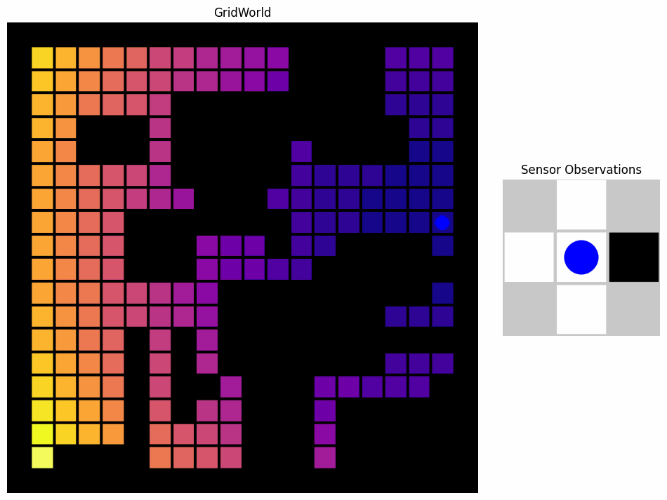

# Localization with HMMs

<p align="center">
  
</p>


## Description

This project is part of the 2024 Estimation & Classification course at Instituto Superior Técnico (IST) in Lisboa. It demonstrates how to perform localization of a robot in a 2D gridworld using Hidden Markov Models (HMMs). 

## Features:
- Random generation and simulation of partially observable gridworlds implemented with [Farama's Gym Environment](https://gymnasium.farama.org/).
- Localization of a robot navigating the environment using HMMs.
- Visualization of global state and local observations with and state probability distribution .

## Installation
1. Clone the repository:

   ```bash
   git clone https://github.com/alcedok/EC-course-mini-project.git
   ```
2. Install dependencies:
    ```bash
    pip install -r requirements.txt
    ```
3. Run notebook `project.ipynb`

## Authors
- [Kevin Alcedo](kevin.alcedo@tecnico.ulisboa.pt) 
- [Dinis Miranda](dinis.miranda@tecnico.ulisboa.pt)

## Acknowledgements 
This project was created the 2024 Estimation & Classification course at Instituto Superior Técnico (IST) in Lisboa under the guidance of Prof. Alexandre Bernandino.

## Disclaimer 
This repository was created for educational purposes; it does not represent production-level code and is not intended for commercial use.